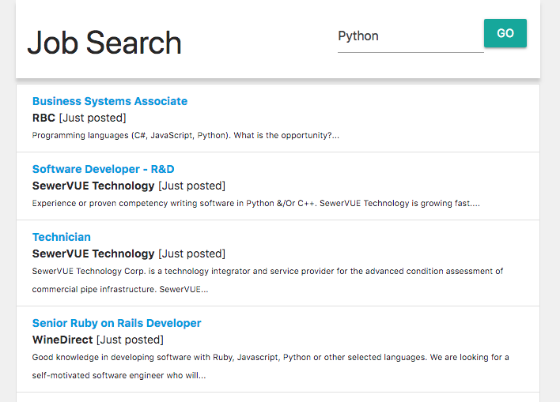

# Python Web Scrapper

A python example script for web page scrapping and data collection.

In this example, scraps the **Indeed.ca** website to find Jobs in *Vancouver, BC*.
By default, the *search term* is "Python".

## Features

* A Python script utility for web scrapping (`scrapper/scrapper.py`)
  * Read the content of a remote URL 
  * Save cached responses for the same search term
  * Parse Job posting entities to get structured information
  * Save CSV and JSON data to be loaded into a database or used by a web/mobile application
* A Django web interface to show dynamic search results  
  * An Indeed.ca clone to search for job terms
  * Uses the scrapper/scrapper.py utility as a back-end search engine
  * Display results using a web interface created with React.js and Materialize.css
* Heroku integration to publish the application automatically in a cloud environment

## Usage

Install the required python libraries

```
pip install bs4
pip install requests
pip install pandas
pip install lxml
pip install Django
pip install gunicorn
pip install django_heroku
```

or install using the `pip` shortcut:

```
pip install -r requirements.txt
```

Execute this command to test the web scrapper script: 

```
python demo.py [searchTerm]
```

The results will be stored in `[searchTerm].csv` and `[searchTerm].json` files in the `./data/` folder.


Example .json file:

```
[
    {
        "id": "p_ed9aac79a2cdb122",
        "text": "Python CI CD Dev",
        "link": "\/rc\/clk?jk=ed9aac79a2cdb122&fccid=8395f0911ec08bde&vjs=3",
        "comp": "Example Company",
        "loc": "Vancouver, BC",
        "desc": "Experience with python and JavaScript Technologies. Python developers are encouraged to apply....",
        "pub": "Just posted"
    },
    {
        "id": "p_6e27c3b05a273a2e",
        "text": "Python Software Engineer",
        "link": "\/rc\/clk?jk=6e27c3b05a273a2e&fccid=55e67e4c356ab20b&vjs=3",
        "comp": "Big Company",
        "loc": "Richmond, BC",
        "desc": "Our stack include Python, Django, C#, .NET, JavaScript and Postgres ....",
        "pub": "1 day ago"
    }
]
```

## Web interface

You can run the following command to start the Django web interface:

```
python manage.py runserver
```

A web server will be started at port 8000 (http://localhost:8000)

In this web interface you can query a word and get the results.

## Screenshot




## Python packages used

* `bs4` - [BeatufulSoup4](https://www.crummy.com/software/BeautifulSoup/) HTML document navigator 
* `requests` - [Requests](http://docs.python-requests.org/en/master/) HTTP library
* `pandas` - [Pandas](https://pandas.pydata.org/) Data analysis library
* `lxml` - [LXml](https://lxml.de/) XML/HTML document parser
* `Django` - [Django](https://docs.djangoproject.com/) Python Web framework


## Front-end components

* [React.js](https://reactjs.org/) - JavaScript library for building user interfaces
* [Materialize.css](https://materializecss.com) - Responsive front-end framework based on Material Design


#
